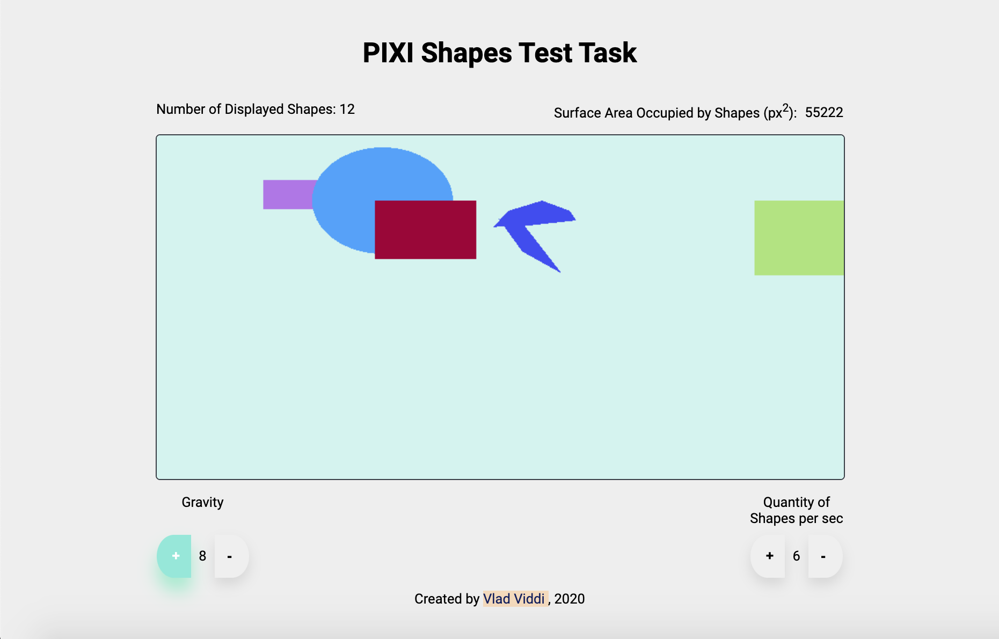
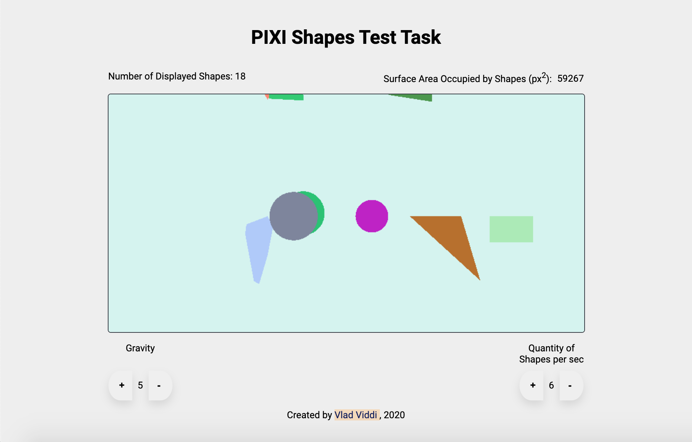

# PIXI_shapes

## Run the project

- Clone project: 'https://github.com/Vlad-Viddi/PIXI_shapes.git';
- Open Project folder: 'cd <PATH to PROJECT FOLDER>;
- Run 'npm install';
- Run 'npm start';
- Open your browser at 'localhost:1234';

## Screenshots of finished project:

